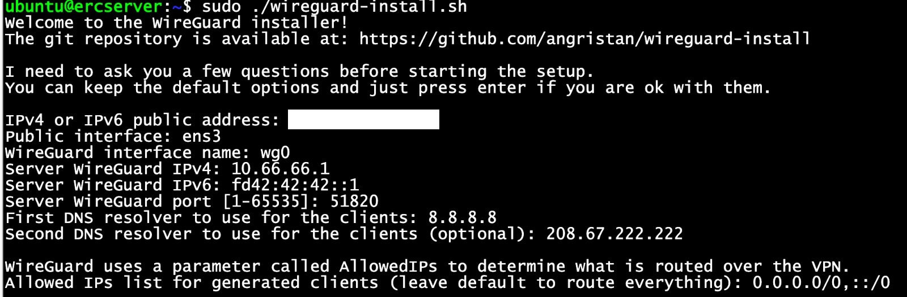
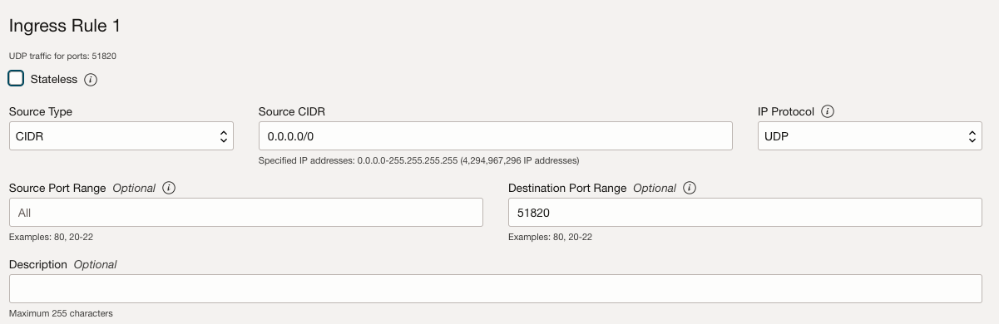

https://cloud.oracle.com 
Create a user, verify your address and phone number. From your credit card Oracle will charge only 0.93 euros for verification and will return it back.  Unless you upgrade your tier specifically there won't bee any fee (At least that's what i've read).

To enter oracle portal, it needs 2fa authentication, oracle has its ownn on playstore and appstore, just install it and login. 

On main screen launch resource - create a vm instance. 
You should continue with the default tiers except the image, select ubuntu 24. It might write 1.85 euros for boot volume, but it is calculating wrong, just continue. 
Do not forget to save private ssh key, you will login to your server with user "ubuntu" and the private key. 

After login execute commands below for wireguard installation : 

    $ curl -O https://raw.githubusercontent.com/angristan/wireguard-install/master/wireguard-install.sh
    $ chmod +x wireguard-install.sh
    $ sudo ./wireguard-install.sh

 
You need to enter your servers assigned public address to the "public address" section. 

After login execute commands below for openvpn  installation : 
    $ curl -O https://raw.githubusercontent.com/angristan/openvpn-install/master/openvpn-install.sh
    $ chmod +x openvpn-install.sh
    $ sudo ./openvpn-install.sh

Also you need to allow incoming wireguard/openvpn requests to the server  on the oracle cloud portal. 

Go to  --> Networking - Virtual Cloud Networks - select your network - on the left menu select  "security-list" e and  default security list  - ingress rules - add ingress rules 
Allow  source ip "::/0" and dest port "51820" (for our example) for udp
 

Execute the command below again to create users, when user is created it will give you a barcode directly: 

    $ sudo ./wireguard-install.sh 
