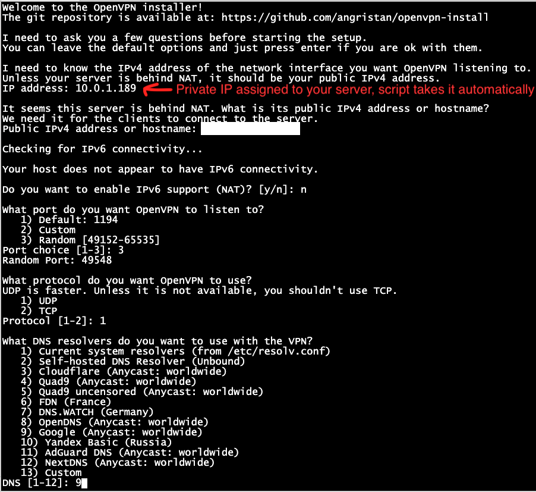

# Oracle Cloud Free Tier Wireguard/OpenVPN Installation Instructions

Go to Oracle Cloud and create a new user account. Verify your email and phone number. Oracle will make a temporary charge of €0.93 to your credit card for verification purposes, which will be refunded. As long as you don't upgrade your tier, there shouldn't be any additional fees (according to their guidelines).

To access the Oracle portal, you'll need to set up two-factor authentication (2FA). Oracle offers its own 2FA app available on the Play Store and App Store. Download and install it, then log in.

On the main dashboard, launch a resource to create a VM instance. Use the default tiers except for the OS image—select Ubuntu 24. Although you might see a charge of €1.85 for the boot volume, it's a miscalculation, so proceed without concern.

Remember to save the private SSH key, as you'll need it to access your server. Log in using the username "ubuntu" and your private key.

***Some operators are blocking wireguard using DPI, if that is the case, use openvpn.***

## Wireguard Installation

After login execute the commands below for wireguard installation : 

    curl -O https://raw.githubusercontent.com/angristan/wireguard-install/master/wireguard-install.sh
    chmod +x wireguard-install.sh
    sudo ./wireguard-install.sh

 
You need to enter your servers assigned public address to the "public address" section. 

Also you need to allow incoming wireguard requests to the server  on the oracle cloud portal. 

Go to  --> Networking - Virtual Cloud Networks - select your network - on the left menu select  "security-list" e and  default security list  - ingress rules - add ingress rules 
Allow  source ip "::/0" and dest port "51820" for udp
 

Execute the command below again to create users, when user is created it will give you a barcode directly: 

    $ sudo ./wireguard-install.sh 

## Openvpn Installation

After login execute commands below for openvpn  installation : 

    curl -O https://raw.githubusercontent.com/angristan/openvpn-install/master/openvpn-install.sh
    chmod +x openvpn-install.sh
    sudo ./openvpn-install.sh
    
 
 
 

Download the ovpn file and import in your client. 

Also you need to allow incoming openvpn requests to the server  on the oracle cloud portal. 

Go to  --> Networking - Virtual Cloud Networks - select your network - on the left menu select  "security-list" e and  default security list  - ingress rules - add ingress rules 
Allow  source ip "::/0" and dest port "49548" for udp example (you need to check your port during installation)
 

Execute the command below again to create additional users etc. (For more info check:  [https://github.com/angristan/openvpn-install](https://github.com/angristan/openvpn-install) 

    sudo ./openvpn-install.sh

There are several ways to download the OpenVPN file to your computer, but here are two simple options:

- Just print the ovpn info to screen and copy paste it on a text editor and save it as an ovpn file.
- Use [WinSCP](https://winscp.net/eng/download.php). with you ssh key and username, browse to "/home/ubuntu/" and download your ovpn file. 
